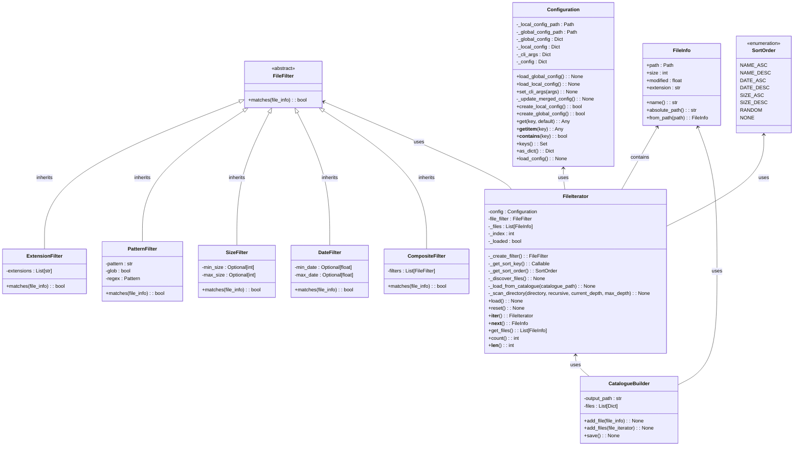
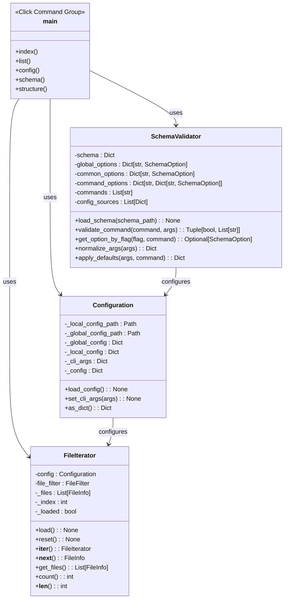

# FileIterator Class Diagram



# CLI Controller Integration



# Usage Examples

## Basic Usage

```python
from docindexer.config import Configuration
from docindexer.file_iterator import FileIterator

# Create a configuration object
config = Configuration()

# Set configuration values
config.set_cli_args({
    "source_folder": "/path/to/documents",
    "recursive": True,
    "pattern": "*.md",
    "sort_by": "date",
    "sort_desc": True,
    "limit": 100
})

# Create a file iterator
file_iterator = FileIterator(config)

# Iterate through files
for file_info in file_iterator:
    print(f"Processing {file_info.name} ({file_info.size} bytes)")
    
    # Do something with the file
    # ...

# Get count of files
count = len(file_iterator)
print(f"Found {count} files")

# Get all files as a list
files = file_iterator.get_files()
```

## CLI Controller Integration

```python
import click
from rich.console import Console
from rich.table import Table
from docindexer.config import Configuration
from docindexer.file_iterator import FileIterator

console = Console()
config = Configuration()

@click.command()
@click.option('--source-folder', '-s', help='Path to the folder containing files')
@click.option('--recursive/--no-recursive', '-r', default=True, help='Process files recursively')
@click.option('--pattern', '-p', help='Pattern to match file names')
def list_files(source_folder, recursive, pattern):
    """List files based on configuration."""
    # Set configuration from command-line arguments
    config.set_cli_args({
        "source_folder": source_folder,
        "recursive": recursive,
        "pattern": pattern
    })
    
    # Create file iterator
    file_iterator = FileIterator(config)
    
    # Display files in a table
    table = Table(title=f"Files in {source_folder}")
    table.add_column("Name", style="cyan")
    table.add_column("Size", style="green", justify="right")
    table.add_column("Modified", style="yellow")
    
    for file_info in file_iterator:
        size_str = f"{file_info.size / 1024:.2f} KB"
        from datetime import datetime
        date_str = datetime.fromtimestamp(file_info.modified).strftime('%Y-%m-%d %H:%M:%S')
        table.add_row(file_info.name, size_str, date_str)
    
    console.print(table)
    
if __name__ == '__main__':
    list_files()
```

## Creating a Catalogue

```python
from docindexer.config import Configuration
from docindexer.file_iterator import FileIterator, CatalogueBuilder

# Create configuration
config = Configuration()
config.set_cli_args({
    "source_folder": "/path/to/documents",
    "recursive": True
})

# Create file iterator
file_iterator = FileIterator(config)

# Create catalogue builder
catalogue_builder = CatalogueBuilder("/path/to/catalogue.json")

# Add files to catalogue
catalogue_builder.add_files(file_iterator)

# Save catalogue
catalogue_builder.save()
```