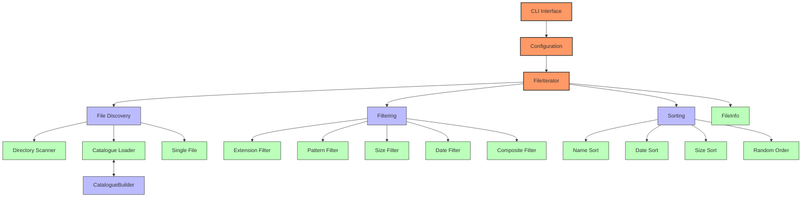
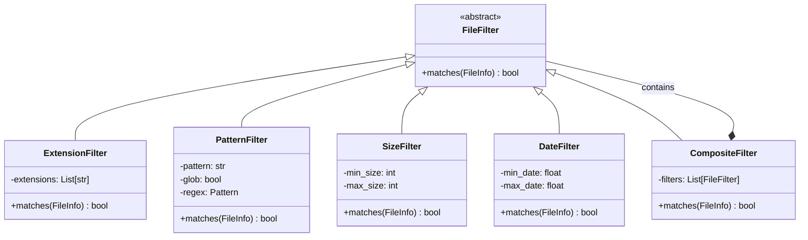
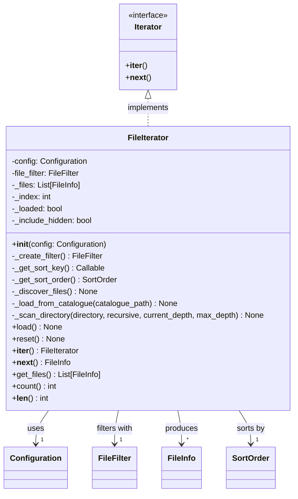
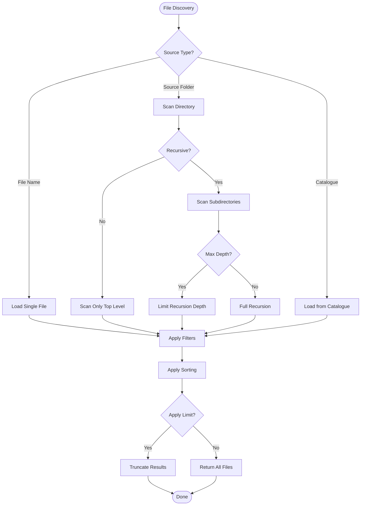
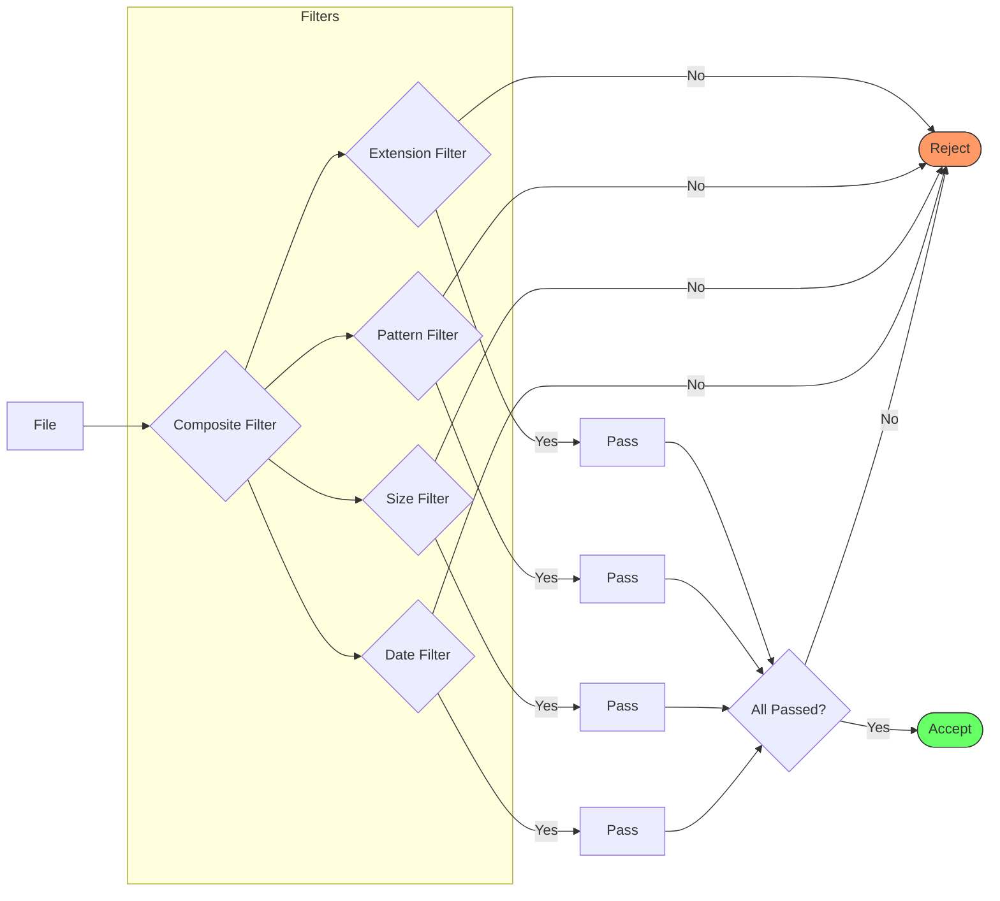
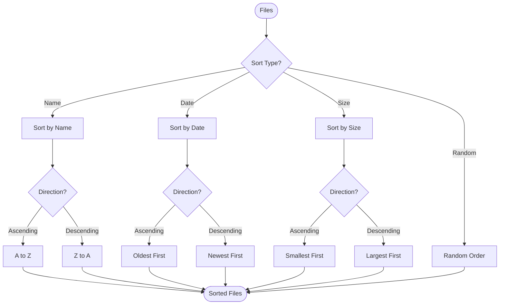
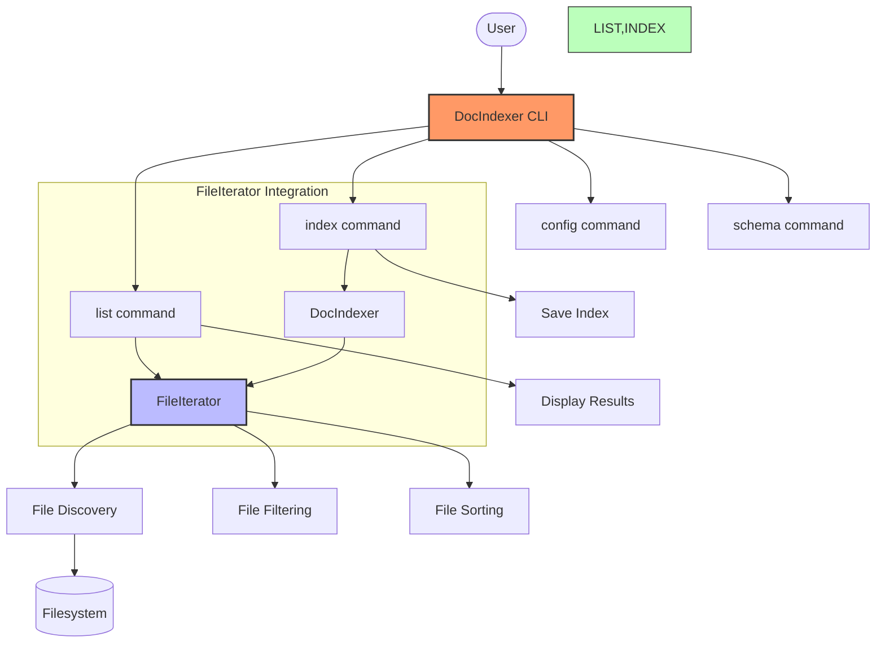
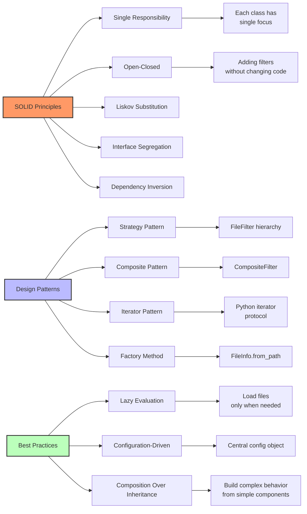
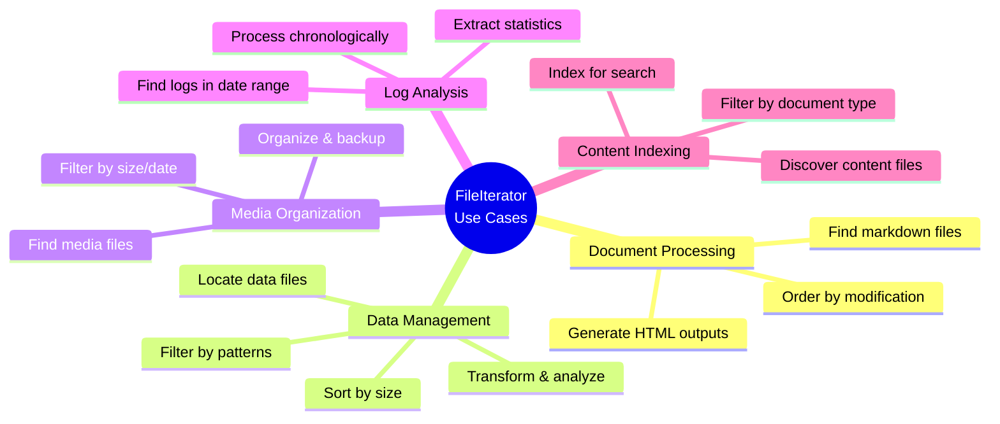

# FileIterator - Comprehensive File Discovery and Filtering System

## Overview

The `FileIterator` is a powerful, configurable system for discovering, filtering, sorting, and iterating through files in a filesystem. It serves as the foundation for the DocIndexer application's file processing capabilities, providing a flexible and efficient way to locate and process files based on various criteria.

This document explains the architecture, capabilities, and usage patterns of the `FileIterator` and its supporting classes.

## System Architecture



## Core Components

### 1. FileInfo

A dataclass that encapsulates metadata about a file:

```python
@dataclass
class FileInfo:
    path: Path           # Path object representing the file location
    size: int            # Size in bytes
    modified: float      # Modification time as Unix timestamp
    extension: str       # File extension (with leading dot)
```

**Key features:**
- Provides convenient properties (`name`, `absolute_path`)
- Factory method `from_path()` to create instances from Path objects
- Used as the primary data structure throughout the iterator system

### 2. FileFilter Hierarchy

An extensible filter system based on the Strategy pattern:



Each filter implements a `matches(file_info)` method that returns `True` if a file meets specific criteria.

### 3. FileIterator

The main class that ties everything together:



The `FileIterator` provides a rich interface for:
- Configurable file discovery
- Filtering and sorting files
- Python iterator protocol support
- Bulk file retrieval

### 4. SortOrder

An enumeration defining different sorting strategies:

```python
class SortOrder(Enum):
    NAME_ASC = auto()
    NAME_DESC = auto()
    DATE_ASC = auto()
    DATE_DESC = auto()
    SIZE_ASC = auto()
    SIZE_DESC = auto()
    RANDOM = auto()
    NONE = auto()
```

### 5. CatalogueBuilder

A utility class for creating and saving file listings:

```python
class CatalogueBuilder:
    def __init__(self, output_path: str):
        # Initialize builder
        
    def add_file(self, file_info: FileInfo) -> None:
        # Add a file to the catalogue
        
    def add_files(self, file_iterator: FileIterator) -> None:
        # Add all files from an iterator
        
    def save(self) -> None:
        # Save the catalogue to a JSON file
```

## Key Features and Capabilities

### 1. Multiple File Discovery Methods



The `FileIterator` can discover files from different sources:

- **Direct file specification**:
  ```python
  # Load a single specific file
  config.set('file_name', '/path/to/file.txt')
  ```

- **Directory scanning**:
  ```python
  # Scan a directory (flat or recursive)
  config.set('source_folder', '/path/to/directory')
  config.set('recursive', True)  # Optional, defaults to True
  ```

- **Catalogue-based loading**:
  ```python
  # Load pre-defined list of files from JSON
  config.set('catalogue', '/path/to/catalogue.json')
  ```

### 2. Comprehensive Filtering System



Files can be filtered based on various criteria:

- **Extension filtering**:
  ```python
  # Built-in support for common document formats
  # .txt, .md, .pdf, .docx, .doc, .html, .htm, .xml, .json
  ```

- **Pattern matching**:
  ```python
  # Glob pattern (default)
  config.set('pattern', '*.md')
  
  # Regular expression
  config.set('pattern', '^README.*\.md$')
  config.set('use_regex', True)
  ```$')
  config.set('use_regex', True)
  ```

- **Size filtering**:
  ```python
  # Limit by file size
  config.set('min_size', 1024)  # Minimum 1KB
  config.set('max_size', 1024*1024)  # Maximum 1MB
  ```

- **Date filtering**:
  ```python
  # Filter by modification date
  config.set('min_date', 1609459200)  # After Jan 1, 2021
  config.set('max_date', 1640995199)  # Before Dec 31, 2021
  ```

All filters can be combined through the `CompositeFilter` which implements logical AND semantics.

### 3. Flexible Sorting Options



Files can be sorted in various ways:

```python
# Sort by name (default)
config.set('sort_by', 'name')

# Sort by modification date (newest first)
config.set('sort_by', 'date')
config.set('sort_desc', True)

# Sort by size (smallest first)
config.set('sort_by', 'size')

# Random order
config.set('random', True)
```

### 4. Recursive Directory Control

Fine-grained control over directory traversal:

```python
# Enable/disable recursion
config.set('recursive', True)  # Default is True

# Limit recursion depth
config.set('max_depth', 3)  # Go no deeper than 3 levels

# Control hidden file inclusion
config.set('include_hidden', True)  # Include .hidden files and directories
```

### 5. Result Limiting

Control the number of files returned:

```python
# Limit to the first N files after filtering and sorting
config.set('limit', 100)
```

### 6. Lazy Loading and Memory Efficiency

The `FileIterator` uses lazy loading to optimize memory usage:

- Files are discovered only when `load()` is called
- Iteration through `__iter__()` and `__next__()` loads files on-demand
- `reset()` allows reuse of the iterator without creating a new instance

### 7. Catalogue Generation

Create JSON catalogues for later reuse:

```python
# Create a catalogue builder
builder = CatalogueBuilder("catalogue.json")

# Add files from an iterator
builder.add_files(file_iterator)

# Save to file
builder.save()
```

Catalogue format:
```json
{
  "files": [
    {
      "path": "/absolute/path/to/file.md",
      "size": 1024,
      "modified": 1635724800,
      "extension": ".md"
    },
    // Additional files...
  ]
}
```

## CLI Integration



The FileIterator functionality is exposed through the DocIndexer CLI:

### 1. List Command

List files matching specific criteria:

```bash
# Basic listing
docindexer list --source-folder /path/to/docs

# Pattern matching with sorting
docindexer list --source-folder /path/to/docs --pattern "*.md" --sort-by date --desc

# Recursive control and limiting
docindexer list --source-folder /path/to/docs --no-recursive
docindexer list --source-folder /path/to/docs --max-depth 2 --limit 50

# Include hidden files/folders
docindexer list --source-folder /path/to/docs --include-hidden

# Random order
docindexer list --source-folder /path/to/docs --random
```

### 2. Index Command

Index documents in a specified path (uses FileIterator internally):

```bash
# Basic indexing
docindexer index /path/to/docs --output index.json

# Control recursion
docindexer index /path/to/docs --recursive --output index.json
```

## Common Usage Patterns

### 1. Basic Iteration

```python
from docindexer.config import Configuration
from docindexer.file_iterator import FileIterator

# Create configuration
config = Configuration()
config.set('source_folder', '/path/to/docs')
config.set('pattern', '*.md')

# Create iterator
iterator = FileIterator(config)

# Process files
for file_info in iterator:
    print(f"Processing {file_info.name} ({file_info.size} bytes)")
    # Process file...
```

### 2. Get All Files at Once

```python
# Create and configure iterator
iterator = FileIterator(config)

# Get all files as a list
all_files = iterator.get_files()

# Get count
file_count = len(iterator)  # or iterator.count()
```

### 3. Create a Catalogue for Later Use

```python
from docindexer.file_iterator import FileIterator, CatalogueBuilder

# Create and configure iterator
iterator = FileIterator(config)

# Create and save catalogue
builder = CatalogueBuilder('docs_catalogue.json')
builder.add_files(iterator)
builder.save()

# Later use the catalogue
config.set('catalogue', 'docs_catalogue.json')
catalogue_iterator = FileIterator(config)
```

## Design Principles and Best Practices



The `FileIterator` and supporting classes follow several important design principles:

1. **Single Responsibility Principle**: Each class has a focused purpose
2. **Open-Closed Principle**: New filters can be added without modifying existing code
3. **Composition over Inheritance**: Complex behavior built through composing simpler components
4. **Lazy Evaluation**: Files are discovered only when needed
5. **Configuration-Driven**: Behavior controlled through a central Configuration object
6. **Iterator Pattern**: Standard Python iteration protocol support

## Performance Considerations

- **Lazy Loading**: Files are only discovered when needed
- **Filtering Early**: Filters are applied during discovery to avoid loading unnecessary files
- **Catalogue Support**: Pre-scanned file lists can be saved for faster reuse
- **Memory Efficiency**: Files are processed one at a time during iteration

## Use Cases



1. **Document Processing Pipeline**:
   - Find all markdown files in a documentation directory
   - Process them in order of last modification
   - Generate HTML or other output formats

2. **Data File Management**:
   - Locate CSV or JSON data files matching specific patterns
   - Sort by size to process smaller files first
   - Apply transformations or analysis

3. **Media File Organization**:
   - Find image or audio files with specific patterns
   - Filter by size or date to identify recent or large files
   - Process for backup or organization

4. **Log Analysis**:
   - Locate log files within date ranges
   - Process in chronological order
   - Extract relevant information or statistics

5. **Content Indexing**:
   - Discover content files across a directory structure
   - Filter by relevant document types
   - Index contents for search or analysis

## Conclusion

The `FileIterator` provides a flexible, efficient foundation for file discovery and processing in the DocIndexer application. Its modular design, powerful filtering capabilities, and adherence to Python best practices make it a versatile tool for a wide range of file processing tasks.

By leveraging the configuration system, users can customize file discovery behavior through the command line or configuration files, while developers can extend the system with new filtering strategies and processing capabilities.